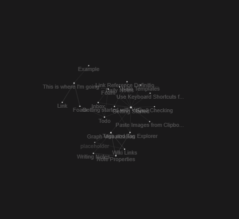

# Foam
[[Index]]

This is just some foam tips. 
- [ ] `Alt`+`C` will fill in [ ] (square) brackets. 
  - [ ] At least under certain conditions, but definitely as used to check items off a list. 
  - [x] See, try it on this line. 
  - [x] You can select multiple lines at once and `Alt`+`C` them as well, 
  - [x] And yes, this is all covered in the foam documentation ([[todo]]). 

- Another neat one is `Alt`+`D`, which creates a link for today's date. 
  - I.e., a daily note. For whatever, daily to do list, etc. 
  
- Okay finally figured out the goddamned graph viewer. 
  - `Ctrl`+`Shift`+`P` to open vscode's "Command Palette." 
  - When they say "Execute the  `Foam: Show Graph` command," this is where they mean you are supposed to do it. 
  - And then, yeah, it shows the graph. Neato. 
  - `Ctrl`-clicking on one of the graph nodes takes you to the associated file, or link. 

- Oh another neat one is image pasting. Do it with `Ctrl+Alt+V`

  - This is enabled by the 'Paste Image' extension. 
  - Settings for the extension can be configured there. 
  - There are two things I'd like to be able to do:
    - [ ] Resize image easily. 
    - [ ] Store images intelligently, like rather than stuffing them all in an "attachments" folder, put them in a folder associated with the link they are on, or something. Idk. 

[//begin]: # "Autogenerated link references for markdown compatibility"
[Index]: index.md "This is where I'm going to start organizing notes."
[todo]: todo.md "Todo"
[//end]: # "Autogenerated link references"